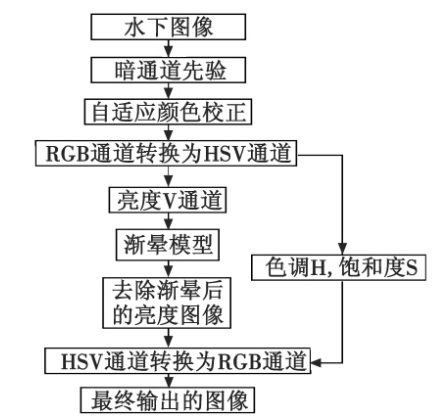
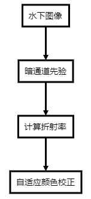

# 基于暗通道先验的水下图像恢复 

## 算法流程

本程序算法主要参考的是四川大学的[基于暗通道先验和自适应颜色校正的水下图像处理](基于暗通道先验和自适应颜色校正的水下图像处理.pdf)。

文章中的算法流程图如下：

本程序实现了暗通道先验及自适应颜色校正，主要的详细流程变更为下图所示：

各部分的内容在参考文献中给出，这里不再赘述。

## 模块说明

### 主模块
1. [mainTest](mainTest.m) : 主程序，包括读取图片，调用各子函数模块
2. [Idark](Idark.m)：计算水下图片的暗通道先验，得到一个和原图片同样大小，但是通道为一的灰度图片
3. [getTransmissivity](getTransmissivity.m)：根据暗通道先验得到的A，计算折射率
4. [colorCorrect](colorCorrect.m)：根据暗通道先验和折射率自适应矫正图像颜色

### 其他
* [test](test.m)：基于直方图均衡的图像增强算法，供测试对比
* [valueImages](valueImages.m)：对比水下原图和算法恢复图片边缘数目变化，测试算法恢复性能

## 程序运行方法：

1. 在InputImages中存入要恢复的图片，修改[mainTest](mainTest.m)中index的值，index要小于等于InputImages文件夹下图片数目，即可读出当前文件夹下对于顺序的第X章图片；
2. 运行主程序无误可以得到一个2X2的figure，可以保存该figure。在程序运行结束后，可以在OutputImages中得到一个ccI.jpg的图片，为最终颜色校正的图片。
